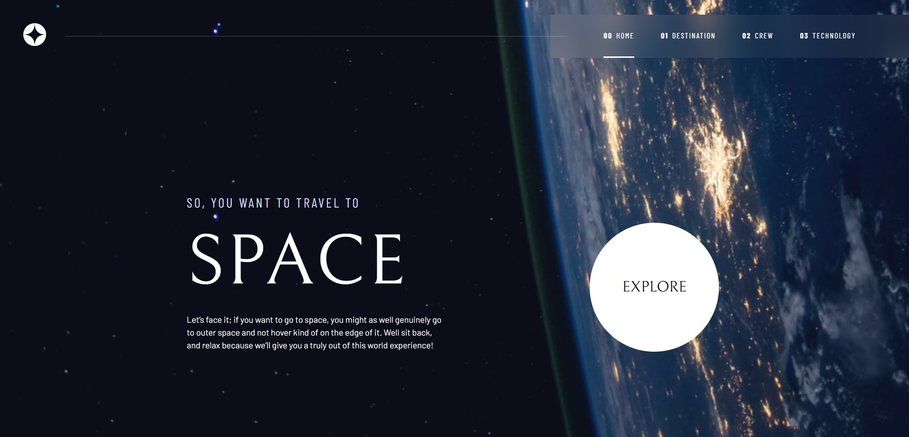

# Frontend Mentor - Space tourism website solution

This is a solution to the [Space tourism website challenge on Frontend Mentor](https://www.frontendmentor.io/challenges/space-tourism-multipage-website-gRWj1URZ3).  

## Table of contents

- [Overview](#overview)
  - [The challenge](#the-challenge)
  - [Screenshot](#screenshot)
  - [Links](#links)
- [My process](#my-process)
  - [Built with](#built-with)
  - [What I learned](#what-i-learned)
  - [Continued development](#continued-development)
  - [Useful resources](#useful-resources)
- [Author](#author)
- [Acknowledgments](#acknowledgments)

## Overview

### The challenge

Users should be able to:

- View the optimal layout for each of the website's pages depending on their device's screen size
- See hover states for all interactive elements on the page
- View each page and be able to toggle between the tabs to see new information

### Screenshot

### Links

- Solution URL: [Add solution URL here](https://your-solution-url.com)
- Live Site URL: [Add live site URL here](https://your-live-site-url.com)

## My process

### Built with

- Semantic HTML5 markup
- CSS custom properties
    - Flexbox
    - CSS Grid
    - Mobile-first workflow
- JavaScript (fetch JSON)

But created with :heart:

### What I learned

- to work with design files
- create mobile/desktop navigation
- use custom properties and utility classes

### Continued development

- Continue learning Figma to work with design files

### Useful resources

- [Example resource 1](https://scrimba.com/build-a-space-travel-website-c014) - Bring a Frontend Mentor design to life and create your own design system while building a multi-page space travel website with Kevin Powell as your guide..

## Author

- Frontend Mentor - [@Darionas](https://www.frontendmentor.io/profile/Darionas)
- GitHub - [Darionas](https://github.com/Darionas)

## Acknowledgments

- Thank you Frontend Mentor team + Scrimba, Kevin Powell for opportunity to try, practice, train myself to work with design files.